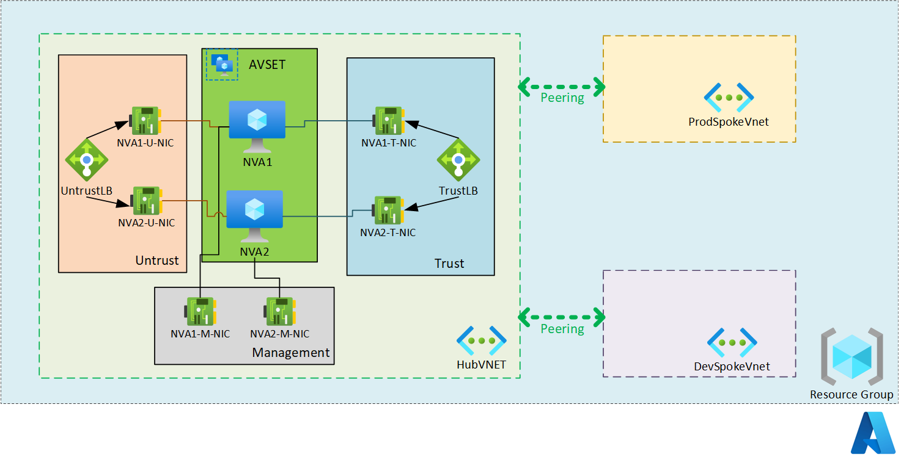

# palo-alto-ha-hub-spoke
ARM Template to deploy Palo Alto VM-Series in High Availability using Hub and Spoke Topology

This template deploys Palo Alto Vm-Series Network Virtual Appliances in High Availability, following the Hub-Spoke topology. 

## Deploying Palo Alto VM-Series Network Virtual Appliances in High Availability

This solution deploys a Hub and Spoke Topology. In the Hub virtual network 2 VM-Series appliances are deployed within an Availability Set to ensure High Availability.

The following resources are deployed as part of the solution

### Resource Group

A single resource group that contains the following resources:

- **Virtual Networks**: 3 Virtual Networks, HubVNET, ProdSpokevnet and Devspokevnet
- **Hub Subnets**: Within the HubVNET 3 subnets are created following the best practices from Palo Alto (Trust, Untrust and Management Subnet)
- **Availability Set**: One Availability Set where both Network Virtual Appliances are deployed to ensure High Availability
- **Virtual Machines**: 2 Virtual machines that use the latest Palo Alto BYOL image available from the standard Azure gallery
- **Network Interfaces**: 6 Network Interfaces (3 for each Virtual machine (1 Trust, 1 Untrust, 1 Management))
- **Load balancers**: 2 Load Balancers, one to handle all the inbound traffic from the Internet (Untrust subnet), another instance placed to handle all the inbound traffic from the spokes (Trust subnet)

### Diagram

 

## Prerequisites

No prerequistes neede for the deployment, if you want a Resource Group to host the resources can be created, otherwise a new resource group can be created at the moment of the deployment.

## Deployment steps

You can click the "deploy to Azure" button at the beginning of this document.

## Notes

It's important to change the password for the local administrator from the parameters.
You will need a valid license to activate your appliance once the deployment concludes.

`Tags: PaloAlto, Vm-Series, HA, ARM template`

## Deployment steps

You can click the "deploy to Azure" button at the beginning of this document or follow the instructions for command line deployment using the scripts in the root of this repo.

## Usage

### Connect

How to connect to the solution

#### Management

How to manage the solution

## Notes

Solution notes

`Tags: Tag1, Tag2, Tag3`
